# Dossier « processus » — Projet dév · Creative Code

**Auteur :** MU · ERACOM / ID432
**Cours :** Projet dév – creative code (20 janvier → 9 juin)
**Dépôt :** <https://github.com/walliser-chas-us-em-terroir/code-sketches>
**Index des projets :** [`index.html`](index.html)

> Ce document est le **dossier d'accompagnement « processus »** demandé dans les consignes :
> notes, captures d'écran, croquis de recherche et documentation des algorithmes / fonctions
> utiles à réutiliser. Une section par croquis, dans l'ordre de la galerie.

---

## Rappel du barème (consignes)

| Critère | Points | État |
|---|---|---|
| Nombre de croquis hebdomadaires | note 2 → 4 | ✅ 20 croquis (+ 1 bonus) |
| Page GitHub avec index + navigation | +1 pt | ✅ `index.html` (grille, lightbox, navigation) |
| Documentation et présentation du « processus » | +1 pt | ✅ ce fichier |
| Qualité du travail | bonus | — |

> **Note — Face Censor Pro :** le dossier [`face-censor-pro/`](face-censor-pro/) est un
> **projet personnel réalisé en bonus, hors du cadre de ce projet et hors barème**. Il n'est
> pas à prendre en compte dans la note. (Détecteur/censeur de visages en p5.js + serveur
> Python InsightFace.)

---

## 🖉 Croquis sur papier quadrillé

Les consignes demandent **au moins un projet réalisé à l'aide d'un croquis sur papier
quadrillé**. Le projet conçu d'abord sur papier est le **n°20 — Fockice (les yeux qui suivent
la souris)**. Tout se pose à la règle sur le quadrillage :

- deux **cercles** (les yeux), de centre `(cx, cy)` et de rayon `irisR` ;
- un **point cible** = la souris `(mouseX, mouseY)` ;
- on trace le **trait** du centre vers la souris : son angle est `a = atan2(dy, dx)` ;
- la **pupille** se place sur ce trait, mais à une distance **bornée** pour rester dans l'œil :
  `d = min(distance, irisR − pupilR)`.

Le croquis montre donc : les deux cercles, la souris à un endroit, le trait, et la pupille
collée au bord intérieur quand la souris est loin → c'est tout l'algorithme en un dessin.

<!-- TODO : déposer ici la photo du croquis papier (ex. sketches/croquis-papier.jpg) -->


*(Emplacement réservé — prendre la photo du croquis papier et remplacer le lien ci-dessus.)*

---

## Les 20 croquis

### 1 — Cercles concentriques
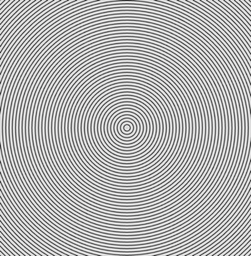
Premier croquis : prise en main de la boucle `draw()`. Un cercle est redessiné à chaque
frame avec un rayon qui grandit (`size += 10`), sans effacer le fond → empilement concentrique.

**À réutiliser :** une variable d'état incrémentée dans `draw()` suffit à créer une animation
de croissance — pas besoin de boucle `for`, c'est le rafraîchissement qui fait le travail.

---

### 2 — Damier parfait
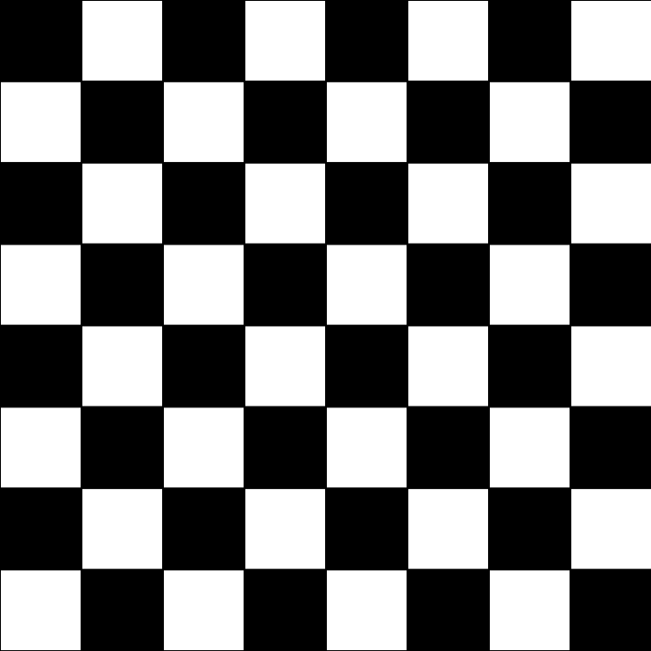
Damier statique. Double boucle `for` sur `x`/`y` par pas de 50 px ; `noLoop()` car l'image est
fixe.

**Algorithme — alternance en damier :**
```js
fill((x + y) / 50 % 2 == 0 ? 0 : 255); // noir/blanc selon la parité de la case
```
La parité de `(colonne + ligne)` donne l'alternance d'échiquier. Motif réutilisé partout.

---

### 3 — Dégradé de couleur
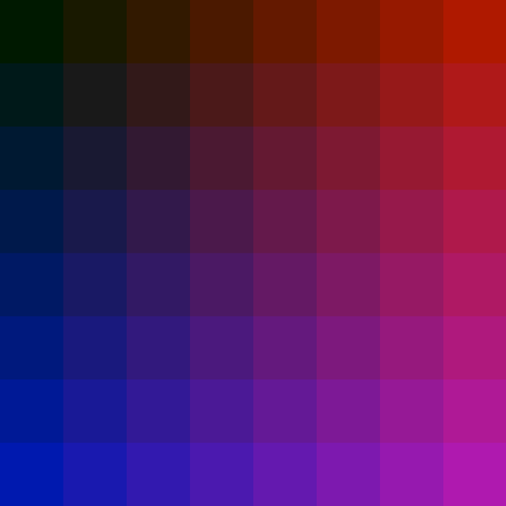
Grille 8×8 de carrés. La composante rouge dépend de `x`, la bleue de `y` → dégradé 2D.

**À réutiliser :** mapper les indices de boucle directement sur les canaux de couleur
(`fill(x*25, 25, y*25)`) est la façon la plus simple de produire un dégradé en grille.

---

### 4 — Générateur QR (faux)
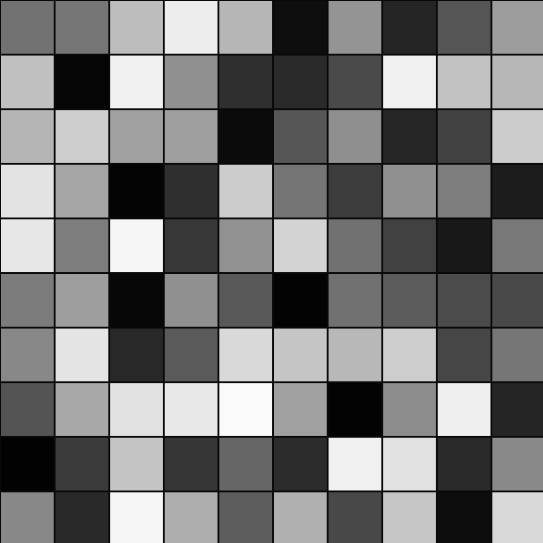
Grille 10×10 remplie de niveaux de gris aléatoires — esthétique « QR code ». Premier usage
d'un **tableau à deux dimensions**.

**Fonction utile — créer un tableau 2D :**
```js
function make2Darray(cols, rows){
  var arr = new Array(cols);
  for (var i = 0; i < arr.length; i++) arr[i] = new Array(rows);
  return arr;
}
```
On remplit `colors[i][j] = random(255)` puis on dessine. Base de tout travail sur grille.

---

### 5 — Zigzag
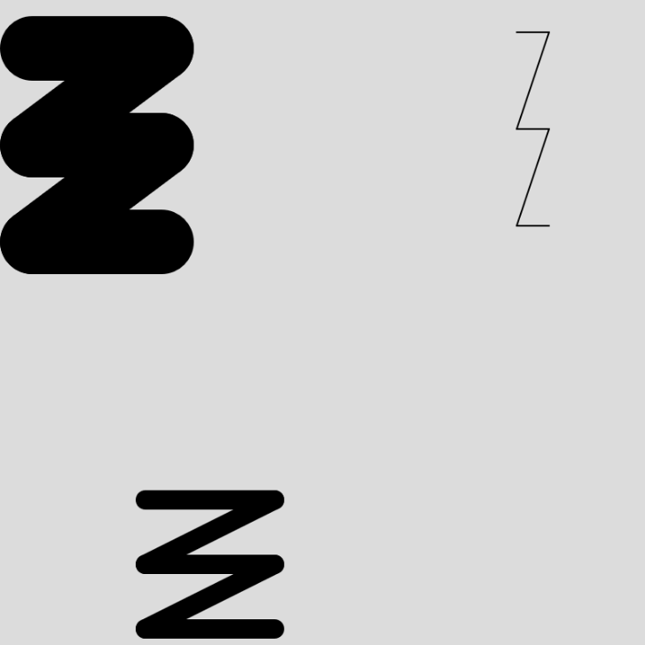
**Première fonction personnalisée paramétrée.** `zigzag(x, y, l, h, e)` trace un motif en
dents à partir d'une position, d'une largeur, d'une hauteur et d'une épaisseur.

**À réutiliser :** isoler un motif dans une fonction `dessine(x, y, …)` permet de le rejouer
à plusieurs endroits/tailles en une ligne — réutilisé partout ensuite.

---

### 6 — Disque DVD
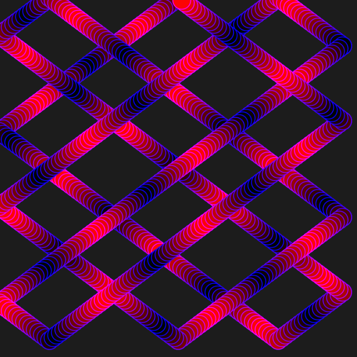
Balle qui rebondit (logique « DVD »). Position `posX/posY` + vitesse `vitX/vitY` ; on inverse
la vitesse au contact d'un bord. Une 3ᵉ « vitesse » `vitR` fait osciller la couleur.

**Algorithme — rebond sur les bords :**
```js
posX += vitX;
if (posX >= width - size || posX <= 0) vitX *= -1; // demi-tour au bord
```
Touche `s` → `save("dessin.png")` pour exporter. Brique de base de toute animation physique.

---

### 7 — Logo DVD (objets + transparence)
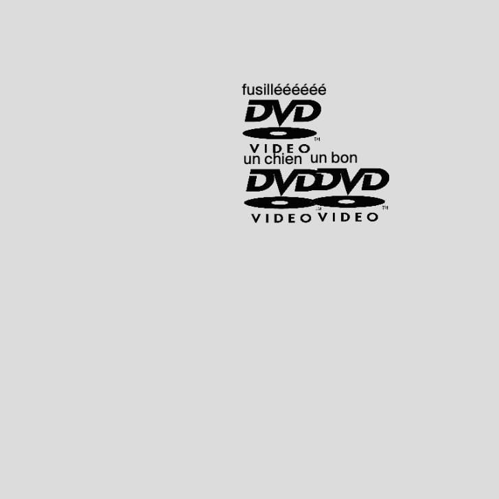
Reprise du rebond, mais en **objets** (`Object.create`) : plusieurs logos partagent la même
méthode `update()`. On rend aussi le blanc du PNG transparent en manipulant les pixels.

**Algorithme — fond blanc → transparent (alpha = 0) :**
```js
logo.loadPixels();
for (let i = 0; i < logo.pixels.length; i += 4) {
  if (logo.pixels[i] > 240 && logo.pixels[i+1] > 240 && logo.pixels[i+2] > 240)
    logo.pixels[i+3] = 0; // canal alpha
}
logo.updatePixels();
```

---

### 8 — Damier fun (rotation locale)
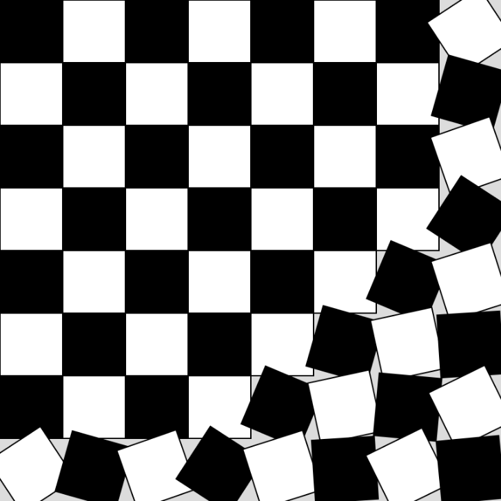
Le damier de base, mais animé : `push()/translate()/rotate()/pop()` autour du centre de
chaque case. Seules les cases au-delà de 60 % de la distance max tournent, et d'autant plus
qu'elles sont loin du coin.

**À réutiliser :** `push()/translate(centre)/rotate()/pop()` pour pivoter un élément autour de
son propre centre sans affecter le reste de la scène + `map`/distance pour doser un effet.

---

### 9 — Drapeaux en mouvement (classe + ondulation)
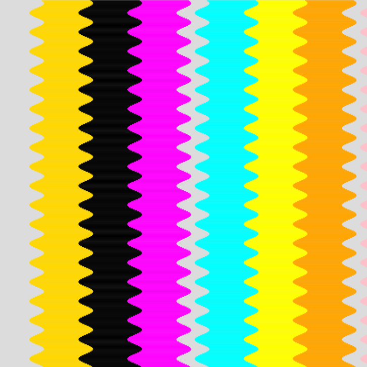
**Première vraie `class`** (`Flag`). Chaque drapeau est découpé en ~500 fines tranches
horizontales décalées par un `sin()` → effet de drapeau qui flotte au vent.

**Algorithme — ondulation par tranches :**
```js
const offset = sin(row * 0.3 + frameCount * 0.05) * amp; // déphasage par ligne + temps
rect(x + i * stripe + offset, y, stripe, sliceH + 1);
```

---

### 10 — Palindrome Checker
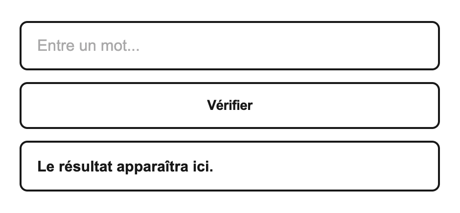
Sortie du dessin : **manipulation de chaînes + DOM**. On nettoie la saisie puis on la compare
à son inverse.

**Fonction utile — test de palindrome :**
```js
function isPalindrome(str){
  const cleaned  = str.toLowerCase().replace(/[\s\-]/g, '');
  const reversed = cleaned.split('').reverse().join('');
  return cleaned === reversed;
}
```
Pattern `split('').reverse().join('')` = inverser une chaîne. Écoute clavier sur `Enter`.

---

### 11 — Oblique Stratégie
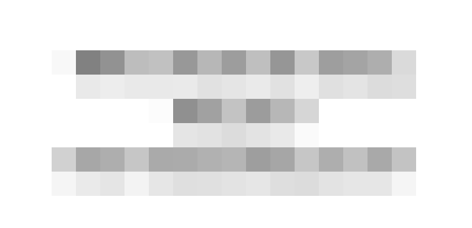
Hommage aux *Oblique Strategies* de Brian Eno : un tableau de ~130 phrases, on en tire une au
hasard. Travail sur les **tableaux** et le tirage aléatoire.

**À réutiliser :** stocker du contenu dans un tableau et piocher avec `random(tableau)` (ou
`tableau[floor(random(tableau.length))]`) — pattern d'aléa de base pour tout générateur.

---

### 12 — Color Flipper
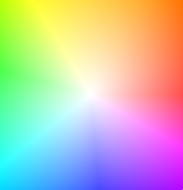
Le fond change de couleur (couleur nommée ou RGB aléatoire). Travail sur le **style CSS piloté
en JS**.

**Fonction utile — couleur RGB aléatoire :**
```js
function randomColor(){
  const R = Math.round(Math.random()*255),
        G = Math.round(Math.random()*255),
        B = Math.round(Math.random()*255);
  stage.style.backgroundColor = `rgb(${R}, ${G}, ${B})`;
}
```

---

### 13 — Pointillisme (spirale de Fermat)
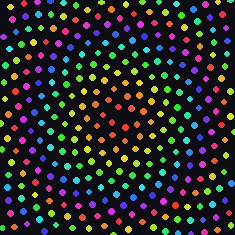
Disposition en **spirale phyllotaxique** : à chaque point, on tourne de l'angle d'or
(137,508°) et on éloigne le point de `√n`. Donne la répartition des graines de tournesol.

**Algorithme — angle d'or :**
```js
const golden = 137.508;
let angle = n * radians(golden);
let r = sqrt(n) * 11.5;
let x = 200 + r * cos(angle), y = 200 + r * sin(angle);
```
Premier usage du `colorMode(HSB)` pour faire varier la teinte avec `n`.

---

### 14 — Destructor (grille qui se désagrège)
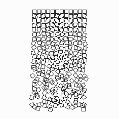
Grille de carrés régulière en haut qui se **désorganise progressivement** vers le bas (clin
d'œil au *Schotter* de Georg Nees). Le facteur `t = row / (rows-1)` (0 → 1) pilote l'amplitude
du désordre.

**Algorithme — désordre croissant :**
```js
let t = row / (rows - 1);            // 0 en haut, 1 en bas
let dx = random(-t*6, t*6);          // décalage qui augmente
let a  = random(-t*HALF_PI, t*HALF_PI); // rotation qui augmente
```

---

### 15 — Hardcorevibe (courbe de Lissajous)
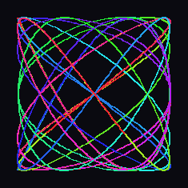
Tracé d'une **courbe de Lissajous** dont les fréquences `a` et `b` suivent la souris. Une
traînée (`trail[]`) garde les 600 derniers points et s'efface en fondu.

**Algorithme — Lissajous + traînée fondue :**
```js
let a = map(mouseX,0,width,1,6), b = map(mouseY,0,height,1,6);
background(0,0,8,12);                 // léger voile → fondu
let x = 185*cos(a*t)+200, y = 185*sin(b*t)+200;
trail.push({x,y,h:(t*28)%360}); if (trail.length>600) trail.shift();
```

---

### 16 — Valaila (paysage de montagnes)
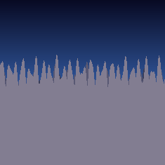
Paysage génératif : ciel en dégradé tracé ligne par ligne, puis **4 couches de montagnes** en
bruit de Perlin (`noise`). Plus la couche est proche, plus l'amplitude et la fréquence
augmentent → profondeur. `seed` rejoue un paysage différent.

**Algorithme — silhouette en bruit de Perlin :**
```js
beginShape(); vertex(0, height);
for (let x = 0; x <= width; x++){
  let n = noise(x * scale + seed + i*137);
  vertex(x, base - n * amp);
}
vertex(width, height); endShape(CLOSE);
```

---

### 17 — Leman Plouf (ondes dans l'eau)
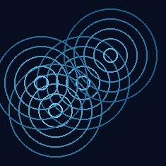
Clic = jet de cailloux dans le Léman. Chaque clic crée 4 objets `Ripple` (classe) : cercles
qui grandissent et s'estompent, puis se suppriment du tableau quand `alpha <= 0`.

**Pattern — système de particules à durée de vie :**
```js
for (let i = ripples.length - 1; i >= 0; i--){ // boucle À L'ENVERS pour pouvoir supprimer
  ripples[i].update(); ripples[i].draw();
  if (ripples[i].isDead()) ripples.splice(i, 1);
}
```
Le fond semi-transparent (`background(…, 18)`) crée la traînée. Pattern réutilisable pour tout
effet de particules.

---

### 18 — Tperduouqwa (motif des 10 PRINT)
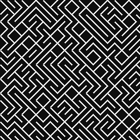
Reprise du célèbre `10 PRINT CHR$(205.5+RND(1)); : GOTO 10` : pour chaque case d'une grille, on
trace au hasard une diagonale `\` ou `/`. Un labyrinthe émerge tout seul.

**Algorithme :**
```js
if (random() < 0.5) line(x, y, x+sz, y+sz);   // \
else                line(x+sz, y, x, y+sz);   // /
```

---

### 19 — Étoile (interactive)
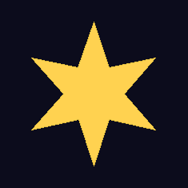
Étoile dessinée par `beginShape/endShape` en alternant rayon externe et interne. Le **nombre
de branches** suit la souris (`map(mouseX, …, 3, 13)`) et l'étoile tourne lentement.

**Algorithme — polygone étoilé à N branches :**
```js
for (let i = 0; i < pts*2; i++){
  let r = (i % 2 === 0) ? outerR : innerR;        // alterne pointe / creux
  let a = (TWO_PI/(pts*2))*i - HALF_PI;
  vertex(cos(a)*r, sin(a)*r);
}
```

---

### 20 — Fockice (yeux qui suivent la souris)
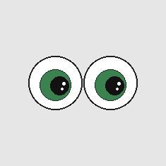
Deux yeux dont la pupille suit le curseur, bornée à l'intérieur de l'iris. Trigonométrie :
`atan2` pour l'angle vers la souris, distance plafonnée à `irisR - pupilR`.

**Algorithme — suivi borné de la souris :**
```js
let a = atan2(mouseY - cy, mouseX - cx);
let d = min(sqrt(dx*dx + dy*dy), irisR - pupilR); // ne sort pas de l'iris
let px = cx + cos(a)*d, py = cy + sin(a)*d;
```

---

## Boîte à outils — fonctions / patterns réutilisables

Récapitulatif des briques revenues le plus souvent, à recopier d'un projet à l'autre :

- **Damier / alternance** : `(x + y) / pas % 2` → noir/blanc (n°2, 8).
- **Tableau 2D** : `make2Darray(cols, rows)` pour toute grille de données (n°4).
- **Rebond sur les bords** : `pos += vit; if (bord) vit *= -1;` (n°6, 7).
- **Rotation locale** : `push(); translate(centre); rotate(a); … pop();` (n°8, 14, 19).
- **Système de particules** : tableau d'objets + boucle inversée + `splice` quand « mort » (n°17).
- **Bruit de Perlin** : `noise(x*scale + seed)` pour des formes organiques (n°16).
- **Spirale phyllotaxique** : angle d'or 137,508° + rayon `√n` (n°13).
- **Traînée en fondu** : `background(c, faible_alpha)` au lieu d'effacer (n°15, 17).
- **`map()`** : relier la souris (`mouseX/mouseY`) à n'importe quel paramètre (n°8, 15, 19, 20).
- **Inverser une chaîne** : `s.split('').reverse().join('')` (n°10).
- **Aléatoire** : `random(min, max)`, `random(tableau)` (n°4, 11, 18).
- **Export** : touche `s` → `save("dessin.png")` (n°6).

---

*Projets publiés sur GitHub · galerie navigable via [`index.html`](index.html).*
